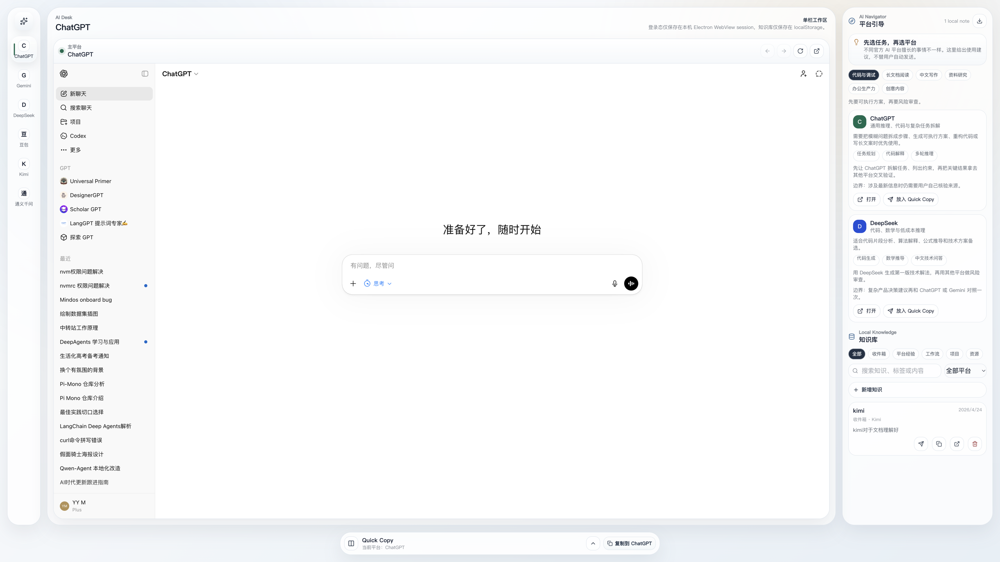

# AI Desk

> Local-first AI workspace for comparing official AI chat platforms, choosing the right tool, and keeping local knowledge notes.

[](https://github.com/YuanyuanMa03/ai-desk/releases)
[](https://yuanyuanma03.github.io/ai-desk/)
[](#development)

AI Desk 是一个本地优先的 AI 聚合工作台。它把常用官方 AI 聊天入口、平台能力引导、双栏对比、本地知识库和轻量 Quick Copy 工具放到一个清爽的桌面/移动/Web 工作界面里。

如果这个项目对你有帮助，请给它一个 Star。你的 Star 是我持续改进 AI Desk 的动力。

**Try it online:** [yuanyuanma03.github.io/ai-desk](https://yuanyuanma03.github.io/ai-desk/)

**Download v1.1.0:** [GitHub Releases](https://github.com/YuanyuanMa03/ai-desk/releases/tag/v1.1.0)

## Preview




Older v1.0 demo video: [AI Desk live demo video](docs/assets/ai-desk-live-demo.mp4).

## Why AI Desk

Most AI workflows still happen across several official chat pages. That is useful, but it is easy to lose prompt drafts, repeat manual setup, and compare answers in a messy way.

AI Desk focuses on the layer around those official products:

- Choose a suitable AI platform based on the task.
- Keep platform notes and workflow knowledge in a local knowledge base.
- Compare platforms without sharing credentials or scraping sessions.
- Keep everything local by default.

## Key Features

### AI Navigator

Pick a task type and see which platform is likely to fit it best. Recommendations cover coding, long documents, Chinese writing, research, office work, and creative content.

### Local Knowledge Base

Save platform notes, comparison takeaways, workflow tips, tags, source platform metadata, and knowledge spaces in local `localStorage`.

Built-in spaces:

- 收件箱
- 平台经验
- 工作流
- 项目
- 资源

Knowledge can be exported as Markdown, so the local notes can later move to a real file-based knowledge base.

### Quick Copy

The prompt box is now a small collapsible utility. Write only when needed, copy to a target platform, then paste and send inside the official page. The app keeps the send action explicit and user-controlled.

Knowledge notes and platform recommendations can also be sent into Quick Copy, which makes saved workflows reusable without turning AI Desk into an automation bot.

### Multi-Platform Workspace

Switch between ChatGPT, Gemini, DeepSeek, Doubao, Kimi, and Tongyi Qianwen from one interface.

### Compare Mode

Use a two-pane desktop layout to compare responses across providers.

### Cross-Platform Builds

The same React app powers:

- Electron desktop app for macOS and Windows
- Capacitor Android app
- Capacitor iOS project
- Static Web deployment

## Built-In Platforms

| Platform | Official URL |
| --- | --- |
| ChatGPT | `https://chatgpt.com` |
| Gemini | `https://gemini.google.com` |
| DeepSeek | `https://chat.deepseek.com` |
| 豆包 | `https://www.doubao.com/chat` |
| Kimi | `https://www.kimi.com` |
| 通义千问 | `https://tongyi.aliyun.com/qianwen` |

## Downloads

Release assets are published on GitHub:

[AI Desk v1.1.0 Release](https://github.com/YuanyuanMa03/ai-desk/releases/tag/v1.1.0)

| Target | Asset |
| --- | --- |
| macOS Apple Silicon | `AI.Desk-1.1.0-mac-arm64.zip` |
| Windows x64 portable | `AI.Desk-1.1.0-x64.exe` |
| Android | `AI.Desk-1.1.0-debug.apk` |
| Web static build | `AI.Desk-1.1.0-web.zip` |

Notes:

- macOS build is ad-hoc signed and not notarized yet.
- Android is currently a debug APK because release signing is not configured yet.
- iOS requires full Xcode and Apple Developer signing before producing a real `.ipa`.

## Web App

The Web version is hosted on GitHub Pages:

[https://yuanyuanma03.github.io/ai-desk/](https://yuanyuanma03.github.io/ai-desk/)

The Web build is static and does not need a server. It can also be deployed to Cloudflare Pages, Vercel, Netlify, or any static host:

```bash
npm run build
```

Deploy the generated `dist/` folder.

Browser limitation: the Web version cannot embed official chat pages like Electron WebView. It keeps AI Navigator, local knowledge notes, Quick Copy, and platform launch flow. Official pages open separately, and the user manually pastes copied text.

## MindOS-Inspired Direction

AI Desk borrows the useful product idea from [MindOS](https://github.com/GeminiLight/MindOS): the AI wrapper should not only open chat pages, it should help users keep reusable context and workflows locally.

Current scope is intentionally lighter than MindOS:

- Keep official web chats in Electron WebView.
- Keep notes local and simple.
- Export notes to Markdown.
- Avoid controlling login state, cookies, or send actions.

Future MindOS-like upgrades can add file-backed Markdown spaces, web clipping, backlinks, full-text search, and a read-only MCP interface for agents.

## Privacy And Boundaries

AI Desk deliberately stays on the safe side of platform boundaries:

- No API reverse engineering
- No login bypass
- No cookie collection or upload
- No shared account behavior
- No automatic bulk sending
- No hidden auto-submit
- Electron login sessions stay inside local WebView partitions
- Knowledge notes stay in local `localStorage`
- Quick Copy text stays only in renderer state unless the user saves it as knowledge

The current workflow is copy-and-paste by design. The user remains in control of login, paste, and send.

## Development

Install dependencies:

```bash
npm install
```

Start the desktop development app:

```bash
npm run dev
```

Run tests:

```bash
npm test
```

Build the production Web/Electron renderer:

```bash
npm run build
```

## Packaging

macOS:

```bash
npm run pack:mac
```

Windows:

```bash
npm run pack:win
```

Android debug APK:

```bash
npm run build:android
```

On the current development machine with Homebrew JDK 21 and Android command line tools:

```bash
npm run build:android:local
```

iOS project:

```bash
npm run open:ios
```

iOS packaging requires full Xcode, an Apple Developer Team, and signing configuration.

## Add A New Platform

Edit [src/config/platforms.ts](src/config/platforms.ts):

```ts
{
  id: "my-platform",
  name: "My Platform",
  url: "https://example.com/chat",
  partition: "persist:ai-desk-my-platform",
  accent: "#0f766e"
}
```

Required fields:

- `id`: stable unique id
- `name`: display name
- `url`: official platform URL
- `partition`: Electron session partition
- `accent`: UI accent color

Then add platform guidance in [src/config/platformGuides.ts](src/config/platformGuides.ts) so AI Navigator can explain when to use the new platform.

## Roadmap

- File-backed Markdown knowledge spaces under a user-chosen local folder
- Web clipping and source capture
- Backlinks and full-text search across local Markdown
- Read-only MCP interface for agents to query local AI Desk knowledge
- Better release signing for macOS and Android
- Optional official API mode when users provide their own credentials
- More structured compare workflows

## License

License is not finalized yet. Treat this repository as source-available until a formal license file is added.
