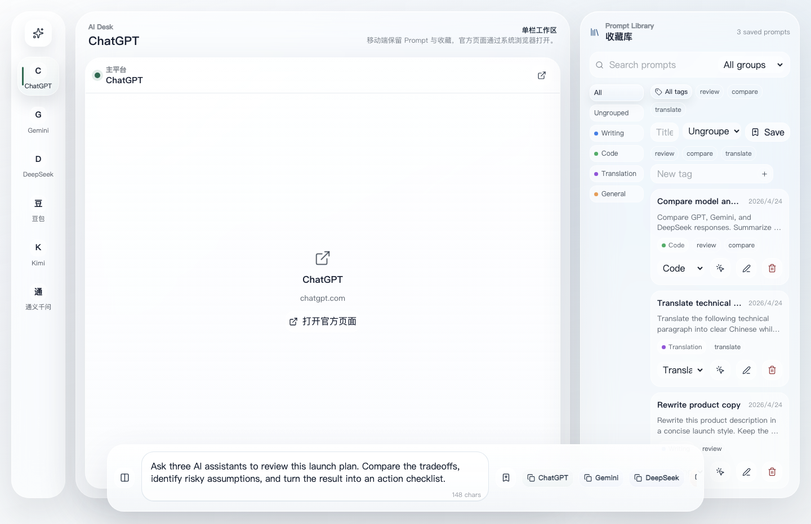
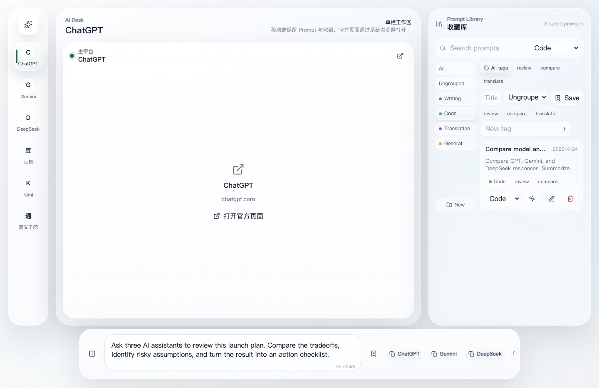

# AI Desk

> Local-first AI workspace for comparing, staging, and reusing prompts across multiple official AI chat platforms.

[](https://github.com/YuanyuanMa03/ai-desk/releases)
[](https://yuanyuanma03.github.io/ai-desk/)
[](#development)

AI Desk 是一个本地优先的 AI 聚合工作台。它把常用官方 AI 聊天入口、统一 Prompt 输入区、双栏对比和 Prompt Library 放到一个清爽的桌面/移动/Web 工作界面里。

如果这个项目对你有帮助，请给它一个 Star。你的 Star 是我持续改进 AI Desk 的动力。

**Try it online:** [yuanyuanma03.github.io/ai-desk](https://yuanyuanma03.github.io/ai-desk/)

**Download v1.0.0:** [GitHub Releases](https://github.com/YuanyuanMa03/ai-desk/releases/tag/v1.0.0)

## Preview

<video src="docs/assets/ai-desk-demo.mp4" controls muted loop playsinline></video>

If the video does not render in your browser, open it directly: [AI Desk demo video](docs/assets/ai-desk-demo.mp4).





## Why AI Desk

Most AI workflows still happen across several official chat pages. That is useful, but it is easy to lose prompt drafts, repeat manual setup, and compare answers in a messy way.

AI Desk focuses on the layer around those official products:

- Stage one prompt and send it to different platforms intentionally.
- Keep reusable prompts in a local Prompt Library.
- Compare platforms without sharing credentials or scraping sessions.
- Keep everything local by default.

## Key Features

### Unified Prompt Dock

Write once, copy to a target platform, then paste and send inside the official page. The app keeps the send action explicit and user-controlled.

### Prompt Library

Save reusable prompts with titles, groups, tags, search, and compact previews. Data is stored in local `localStorage`.

### Multi-Platform Workspace

Switch between ChatGPT, Gemini, DeepSeek, Doubao, Kimi, and Tongyi Qianwen from one interface.

### Compare Mode

Use a two-pane desktop layout to compare responses across providers.

### Cross-Platform Builds

The same React app powers:

- Electron desktop app for macOS and Windows
- Capacitor Android app
- Capacitor iOS project
- Static Web deployment

## Built-In Platforms

| Platform | Official URL |
| --- | --- |
| ChatGPT | `https://chatgpt.com` |
| Gemini | `https://gemini.google.com` |
| DeepSeek | `https://chat.deepseek.com` |
| 豆包 | `https://www.doubao.com/chat` |
| Kimi | `https://www.kimi.com` |
| 通义千问 | `https://tongyi.aliyun.com/qianwen` |

## Downloads

Release assets are published on GitHub:

[AI Desk v1.0.0 Release](https://github.com/YuanyuanMa03/ai-desk/releases/tag/v1.0.0)

| Target | Asset |
| --- | --- |
| macOS Apple Silicon | `AI.Desk-1.0.0-mac-arm64.zip` |
| Windows x64 portable | `AI.Desk-1.0.0-x64.exe` |
| Android | `AI.Desk-1.0.0-debug.apk` |
| Web static build | `AI.Desk-1.0.0-web.zip` |

Notes:

- macOS build is ad-hoc signed and not notarized yet.
- Android is currently a debug APK because release signing is not configured yet.
- iOS requires full Xcode and Apple Developer signing before producing a real `.ipa`.

## Web App

The Web version is hosted on GitHub Pages:

[https://yuanyuanma03.github.io/ai-desk/](https://yuanyuanma03.github.io/ai-desk/)

The Web build is static and does not need a server. It can also be deployed to Cloudflare Pages, Vercel, Netlify, or any static host:

```bash
npm run build
```

Deploy the generated `dist/` folder.

Browser limitation: the Web version cannot embed official chat pages like Electron WebView. It keeps the prompt dock, Prompt Library, copy action, and platform launch flow. Official pages open separately, and the user manually pastes the copied prompt.

## Privacy And Boundaries

AI Desk deliberately stays on the safe side of platform boundaries:

- No API reverse engineering
- No login bypass
- No cookie collection or upload
- No shared account behavior
- No automatic bulk sending
- No hidden auto-submit
- Electron login sessions stay inside local WebView partitions
- Prompts, groups, tags, and favorites stay in local `localStorage`

The current workflow is copy-and-paste by design. The user remains in control of login, paste, and send.

## Development

Install dependencies:

```bash
npm install
```

Start the desktop development app:

```bash
npm run dev
```

Run tests:

```bash
npm test
```

Build the production Web/Electron renderer:

```bash
npm run build
```

## Packaging

macOS:

```bash
npm run pack:mac
```

Windows:

```bash
npm run pack:win
```

Android debug APK:

```bash
npm run build:android
```

On the current development machine with Homebrew JDK 21 and Android command line tools:

```bash
npm run build:android:local
```

iOS project:

```bash
npm run open:ios
```

iOS packaging requires full Xcode, an Apple Developer Team, and signing configuration.

## Add A New Platform

Edit [src/config/platforms.ts](src/config/platforms.ts):

```ts
{
  id: "my-platform",
  name: "My Platform",
  url: "https://example.com/chat",
  partition: "persist:ai-desk-my-platform",
  accent: "#0f766e"
}
```

Required fields:

- `id`: stable unique id
- `name`: display name
- `url`: official platform URL
- `partition`: Electron session partition
- `accent`: UI accent color

## Roadmap

- Project spaces for organizing prompt work by topic
- Markdown export for prompts, notes, and results
- Better release signing for macOS and Android
- Optional official API mode when users provide their own credentials
- More structured compare workflows

## License

License is not finalized yet. Treat this repository as source-available until a formal license file is added.
